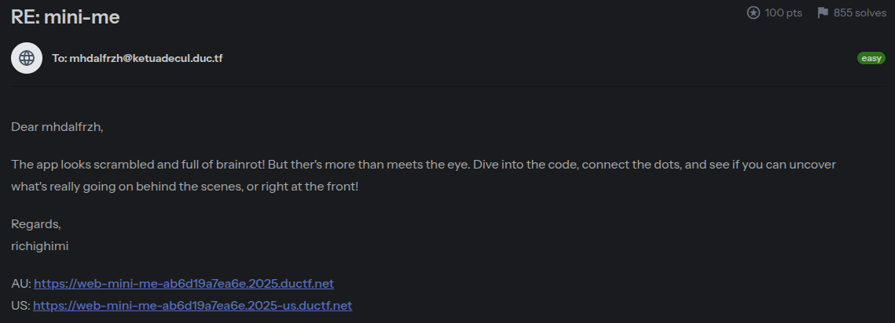
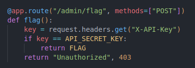
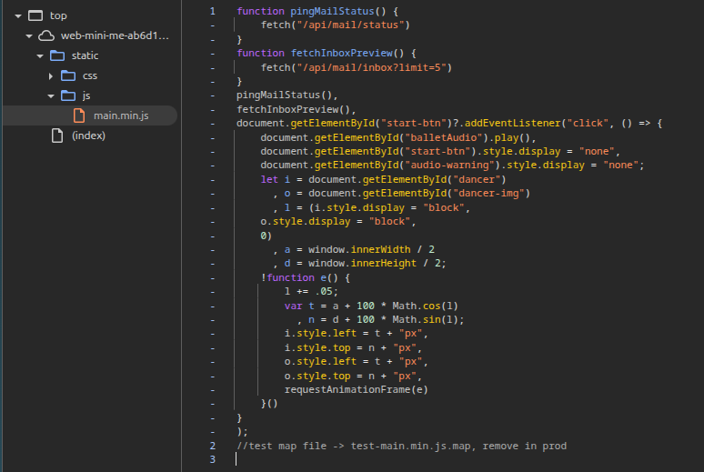
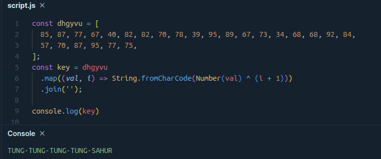
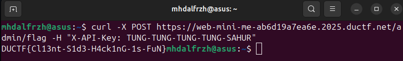

Diberikan sebuah website dan source code backend dari web tersebut. Setelah menganalisis code backend, terlihat jelas kita butuh API_SECRET_KEY untuk mendapatkan flagnya. Namun harus perlu dicari tau dimana key ini disimpan.


Berdasarkan deskripsi soal, kemungkinan terdapat hint di sisi frontend. Pada tab network terdapat sebuah petunjuk.


Hmm apakah source map nya masih terdapat di production? Coba kita cek.
> https://web-mini-me-ab6d19a7ea6e.2025.ductf.net/static/js/test-main.min.js.map

Kita dapet source main.js asli sebelum diminify. Terdapat sebuah hidden function yang tidak pernah dipanggil.
```javascript
function qyrbkc() {
  const dhgyvu = [85, 87, 77, 67, 40, 82, 82, 70, 78, 39, 95, 89,
                  67, 73, 34, 68, 68, 92, 84, 57, 70, 87, 95, 77, 75];
  const key = dhgyvu.map((val, i) =>
    String.fromCharCode(Number(val) ^ (i + 1))
  ).join('');
  console.log("Note: Key is now secured with heavy obfuscation, should be safe to use in prod :)");
}
```
Kemungkinan key nya ada disini, tinggal di console aja key nya.


Kita tinggal hit aja endpoint /admin/flag dengan value X_API_KEY = TUNG-TUNG-TUNG-SAHUR


**Flag: DUCTF{Cl13nt-S1d3-H4ck1nG-1s-FuN}**