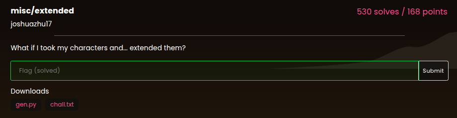

Pada challenge ini, diberikan sebuah file script `gen.py` dan file output `chall.txt`.

Berikut isi dari `gen.py`:

```python
flag = "lactf{REDACTED}"
extended_flag = ""

for c in flag:
    # Mengubah karakter ke biner 8-bit (contoh: 'A' -> 01000001)
    o = bin(ord(c))[2:].zfill(8)

    # Mengubah bit '0' pertama yang ditemukan menjadi '1'
    for i in range(8):
        if o[i] == "0":
            o = o[:i] + "1" + o[i + 1 :]
            break

    # Mengonversi kembali biner ke karakter
    extended_flag += chr(int(o, 2))

print(extended_flag)

with open("chall.txt", "wb") as f:
    f.write(extended_flag.encode("iso8859-1"))
```

Isi dari file `chall.txt` adalah string hasil encode berikut:
> `ìáãôæûÆõîîéìùßÅîïõçèßÔèéóßÌïïëóßÄéææåòåîôßÏîßÍáãßÁîäß×éîäï÷óý`

Logika enkripsi pada script di atas bekerja dengan cara:
1. Mengonversi setiap karakter flag menjadi representasi biner 8-bit.
2. Karena karakter ASCII standar memiliki nilai di bawah 128, bit paling kiri selalu bernilai `0`.
3. Script kemudian mengubah bit `0` pertama tersebut menjadi `1`, sehingga karakter bergeser ke rentang *Extended ASCII* (ISO-8859-1).

Untuk merekonstruksi flag asli, kita cukup membalik prosesnya:
- Konversi tiap karakter pada string *encoded* ke biner 8-bit.
- Ubah bit `1` pertama yang ditemui kembali menjadi `0`.
- Konversi biner tersebut kembali menjadi karakter ASCII.

Berikut script Python untuk mendekode string dan mendapatkan flag asli:

```python
extended_flag = "ìáãôæûÆõîîéìùßÅîïõçèßÔèéóßÌïïëóßÄéææåòåîôßÏîßÍáãßÁîäß×éîäï÷óý"
original_flag = ""

for c in extended_flag:
    o = bin(ord(c))[2:].zfill(8)  # Konversi ke biner 8-bit
    
    # Kembalikan bit '1' pertama menjadi '0'
    for i in range(8):
        if o[i] == "1":
            o = o[:i] + "0" + o[i + 1:]
            break

    original_flag += chr(int(o, 2))  # Konversi kembali ke karakter ASCII

print(original_flag)
```

**Flag:** `lactf{Funnily_Enough_This_Looks_Different_On_Mac_And_Windows}`