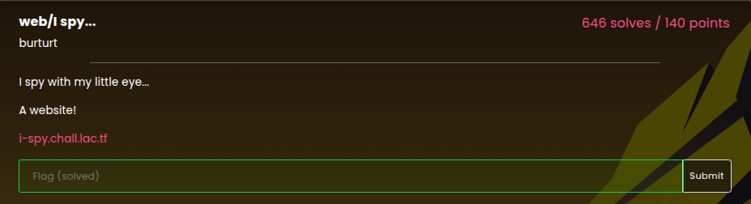
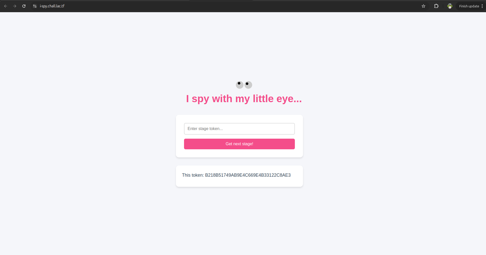
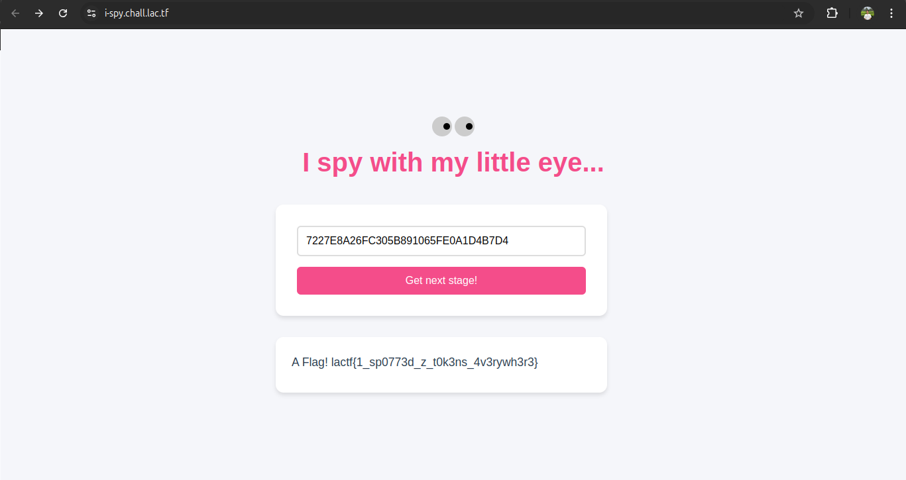

Pada soal diberikan sebuah web berikut.

Untuk lanjut ke stage berikutnya, saya harus dapetin token berdasarkan hint yang diberikan. Hint untuk setiap stage yang dilewati :
1. A token in the HTML source code
2. A token in the JavaScript console
3. A token in the stylesheet (File css dalam source code)
4. A token in javascript code
5. A token in a header (Pada header request ke API)
6. A token in a cookie
7. A token where the robots are forbidden from visiting (Buka path /robots.txt lalu terdapat disallow / a-magical-token.txt)
8. A token where Google is told what pages to visit and index (/sitemap.xml)
9. A token received when making a DELETE request to this page (Bikin request ke API pake method DELETE)
10. A token in a TXT record at i-spy.chall.lac.tf (https://www.nslookup.io/domains/i-spy.chall.lac.tf/dns-records/txt/)

**Flag : lactf{1_sp0773d_z_t0k3ns_4v3rywh3r3}**