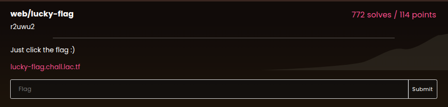
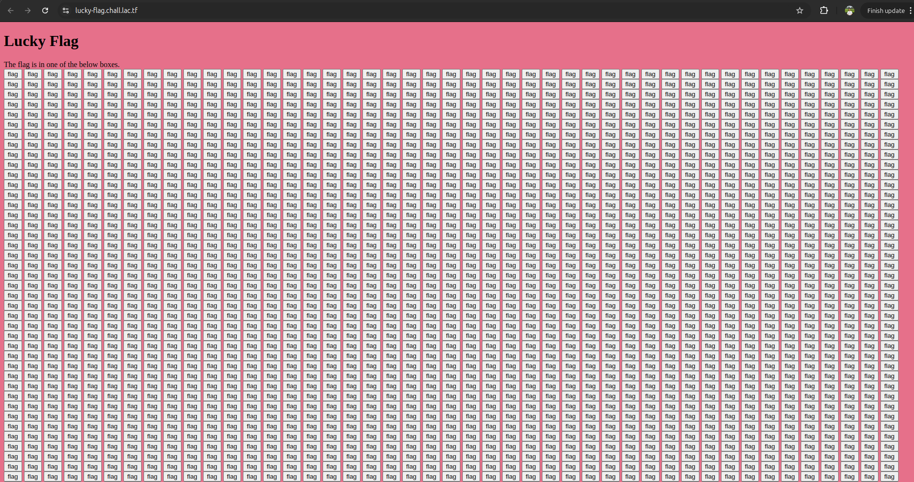
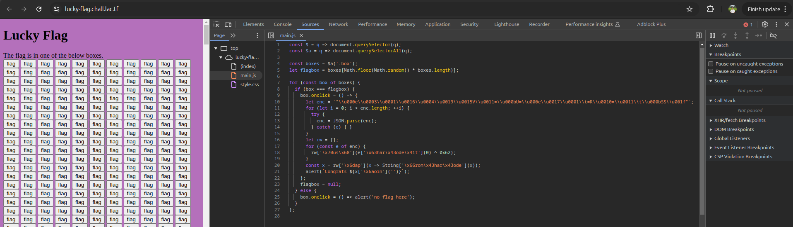
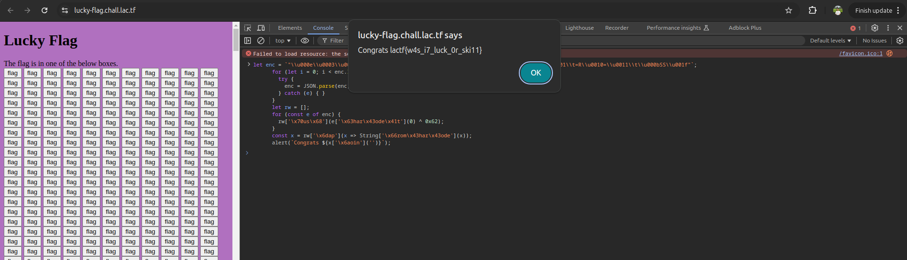

Pada challenge ini, diberikan sebuah website yang menampilkan ribuan kotak (*box*). Dari sekian banyak kotak tersebut, hanya ada satu kotak acak yang akan memunculkan flag saat diklik.

Mencari kotak yang benar secara manual tentu tidak efisien. Oleh karena itu, kita periksa source code JavaScript (`main.js`) melalui *Developer Tools → Sources*.

Pada `main.js`, sistem memilih satu kotak secara acak (`Math.random()`) dan memasang event listener `onclick` khusus. Di dalam handler tersebut, terdapat string terobfuskasi (`enc`) yang didekode menggunakan operasi XOR `0x62` untuk menghasilkan flag pada fungsi `alert()`.

Kita tidak perlu mencari atau mengklik kotak yang benar. Cukup salin blok kode dekripsi flag tersebut lalu jalankan langsung di *Developer Tools → Console*:

Browser akan menampilkan pop-up alert berisi flag.

**Flag:** `lactf{w4s_i7_luck_0r_ski11}`