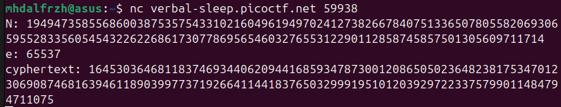

Pada soal diberikan parameter RSA berupa modulus N, public exponent e, dan ciphertext. Tugas kita adalah mendekkripsi ciphertext dan mendapatkan flag.


Berdasarkan hint sepertinya ada yang menarik dari nilai N. Jika diperhatikan digit terakhir N adalah genap yang berarti
```
N % 2 == 0
```
Sedangkan dalam RSA yang benar
```
N = p x q
p dan q harus bilangan prima ganjil
```

Karena N genap maka salah satu faktornya pasti 2. Ini adalah kesalahan fatal dalam implementasi RSA karena membuat proses faktorisasi menjadi sangat mudah.
```python
from Crypto.Util.number import long_to_bytes

n = 19494735855686003875357543310216049619497024127382667840751336507805582069306595528335605454322622686173077869565460327655312290112858745857501305609711714
e = 65537
c = 16453036468118374693440620944168593478730012086505023648238175347012306908746816394611890399773719266411441837650329991951012039297223375799011484794711075

p = 2
q = n // 2

phi = (p - 1) * (q - 1)
d = pow(e, -1, phi)

m = pow(c, d, n)
print(long_to_bytes(m))
```

**Flag : picoCTF{tw0_1$_pr!m3de643ad5}**