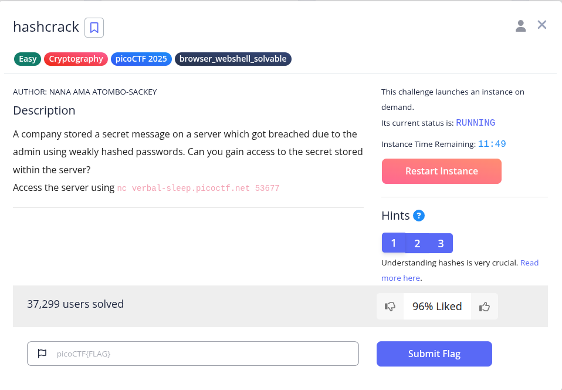
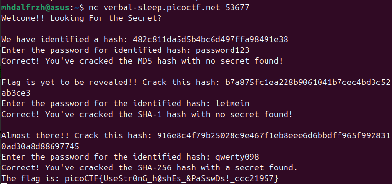

Pada soal diberikan beberapa hash dan diminta menemukan plaintext dari hash tersebut. Karena ini soal easy, hash yang diberikan termasuk hash lemah dan mudah dicrack. Jadi kita bisa gunakan cracking online seperti CrackStation.

**Flag : picoCTF{UseStr0nG_h@shEs_&PaSswDs!_ccc21957}**