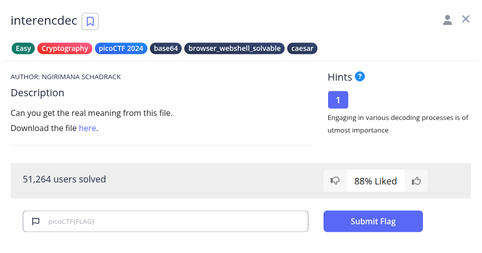
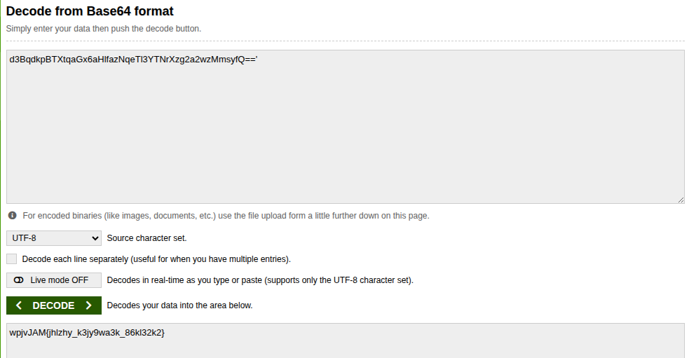
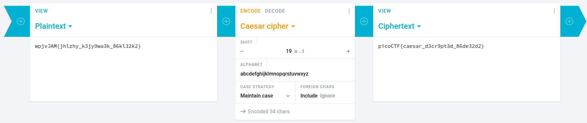

Pada soal diberikan sebuah teks terenkripsi. Nama soal interencdec merupakan hint bahwa pesan tersebut mengalami proses enkripsi dan dekripsi secara bergantian. Biasnya encoding yang digunakan adalah base64.
```
YidkM0JxZGtwQlRYdHFhR3g2YUhsZmF6TnFlVGwzWVROclh6ZzJhMnd6TW1zeWZRPT0nCg==
```

Berikut hasil decode base64 yang pertama.


Lalu ambil string dalam tanda petik untuk mendapatkan hasil decode yang kedua.


Sepertinya hasil decode dari lapisan kedua adalah caesar chiper jadi langsung bisa kita decode lagi.


**Flag : picoCTF{caesar_d3cr9pt3d_86de32d2}**