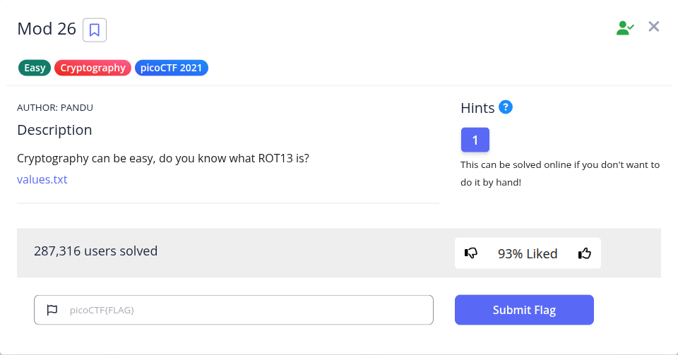
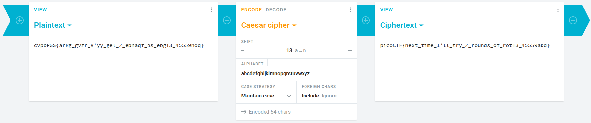

Pada challenge ini, kita diberikan file `values.txt` yang berisi string terenkripsi:

```text
cvpbPGS{arkg_gvzr_V'yy_gel_2_ebhaqf_bs_ebg13_45559noq}
```

Judul *Mod 26* merujuk pada konsep aritmetika modulo 26 (jumlah huruf dalam alfabet latin). Selain itu, deskripsi soal secara langsung memberikan petunjuk tentang penggunaan **ROT13**, yaitu varian Caesar Cipher dengan pergeseran 13 posisi huruf.

Dengan memasukkan teks tersebut ke dalam decoder online (seperti Cryptii atau CyberChef) menggunakan konfigurasi Caesar Cipher *shift* 13:



**Flag:** `picoCTF{next_time_I'll_try_2_rounds_of_rot13_45559abd}`