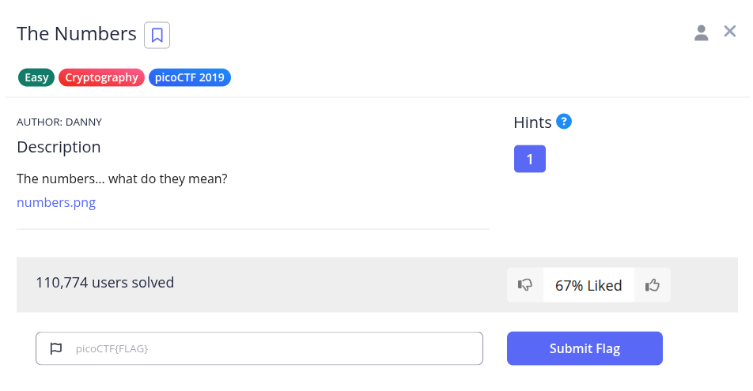
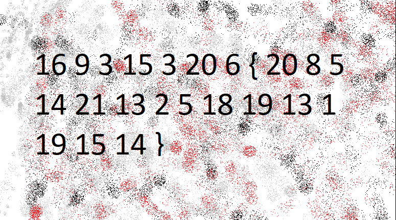
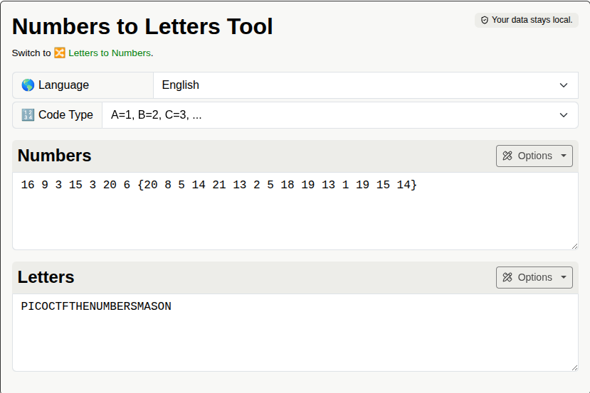

Pada challenge ini, diberikan sebuah file gambar bernama `numbers.png`.



Gambar tersebut menampilkan deretan angka dengan format tanda kurung kurawal `{ }`:

```text
16 9 3 15 3 20 6 { 20 8 5 14 21 13 2 5 18 19 13 1 19 15 14 }
```

Pola tersebut menggunakan substitusi posisi alfabet atau sandi **A1Z26** ($A=1, B=2, \dots, Z=26$). Jika kita petakan angka sebelum tanda kurung:
- `16 9 3 15 3 20 6` $\rightarrow$ `P I C O C T F`

Polanya tepat membentuk prefix format flag `PICOCTF{`. Dengan mengonversi seluruh angka tersebut menggunakan decoder online (*Numbers to Letters Tool*):



**Flag:** `PICOCTF{THENUMBERSMASON}`