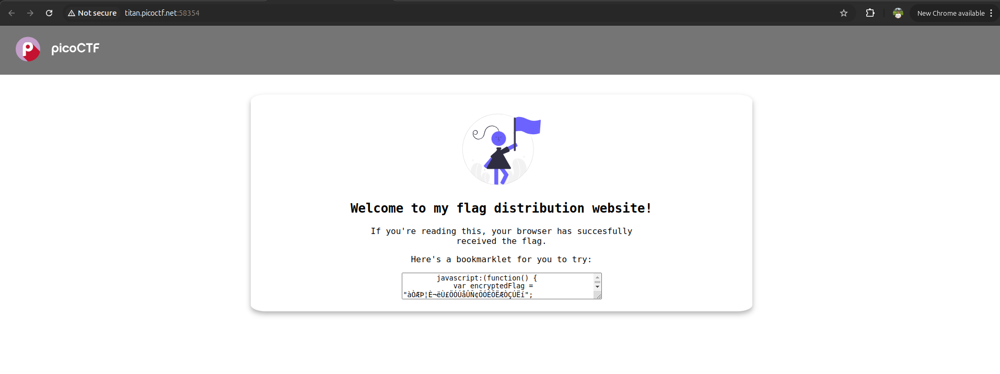

Hint :
- A bookmarklet is a bookmark that runs JavaScript instead of loading a webpage.
- What happens when you click a bookmarklet?
- Web browsers have other ways to run JavaScript too.

Pada soal diberikan sebuah web berikut

Harusnya script itu disimpen di bookmark berdasarkan hintnya tapi sepertinya chrome ga support bookmark code javascript, jadi saya jalanin aja codenya di console.

**Flag : picoCTF{p@g3_turn3r_cebccdfe}**