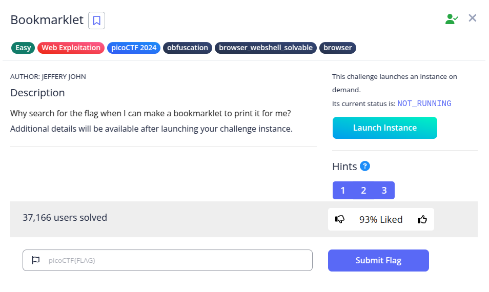
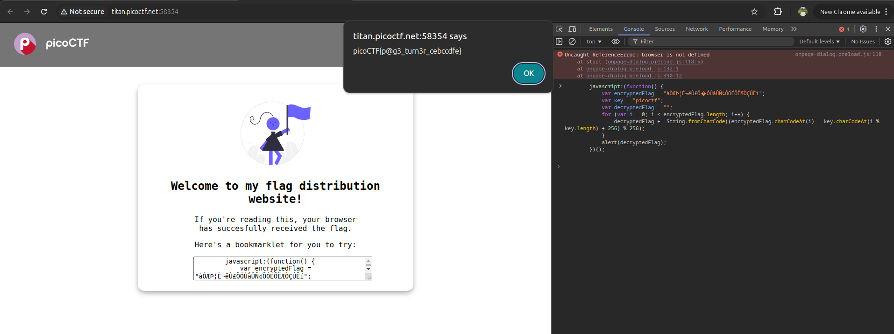

Diberikan sebuah website dengan beberapa hint berikut:
- A bookmarklet is a bookmark that runs JavaScript instead of loading a webpage.
- What happens when you click a bookmarklet?
- Web browsers have other ways to run JavaScript too.

Hint tersebut mengarah pada konsep bookmarklet, yaitu bookmark yang berisi kode JavaScript yang akan dijalankan ketika bookmark tersebut diklik, bukan membuka sebuah URL.

Pada halaman challenge terdapat sebuah script JavaScript yang seharusnya dijalankan sebagai bookmarklet.

Karena bookmarklet pada dasarnya hanyalah JavaScript yang dijalankan di halaman web, cara yang lebih mudah adalah dengan menjalankan script tersebut langsung melalui Developer Tools Console.

**Flag : picoCTF{p@g3_turn3r_cebccdfe}**