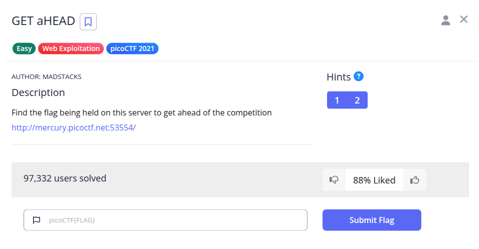
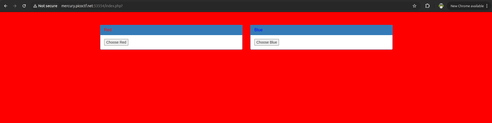
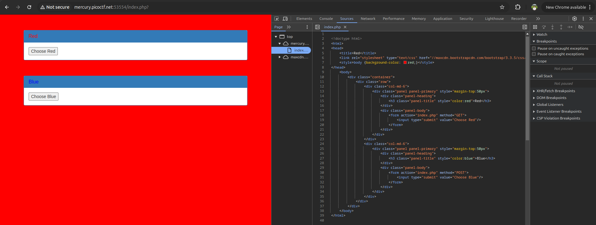
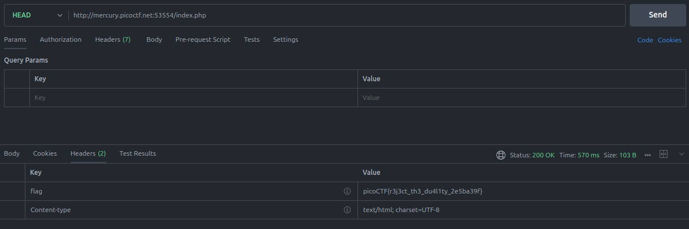

Pada challenge ini, kita diberikan sebuah website dengan dua tombol pilihan warna (*Choose Red* dan *Choose Blue*).

Saat memeriksa source code halaman web melalui *Developer Tools → Sources*, terlihat bahwa:
- Tombol **Choose Red** mengirimkan request dengan method `GET`.
- Tombol **Choose Blue** mengirimkan request dengan method `POST`.

Petunjuk utama terletak pada judul soal (*GET aHEAD*) dan hint (*"Maybe you have more than 2 choices"*). Kapitalisasi judul mengarah langsung pada HTTP method **`HEAD`**.

Dengan mengirimkan HTTP request menggunakan method `HEAD` ke `index.php` (dapat menggunakan Postman, Burp Suite, atau perintah `curl -I http://mercury.picoctf.net:53554/index.php`):

Server mengembalikan response header khusus `flag` yang berisi flag target.

**Flag:** `picoCTF{r3j3ct_th3_du4l1ty_2e5ba39f}`
