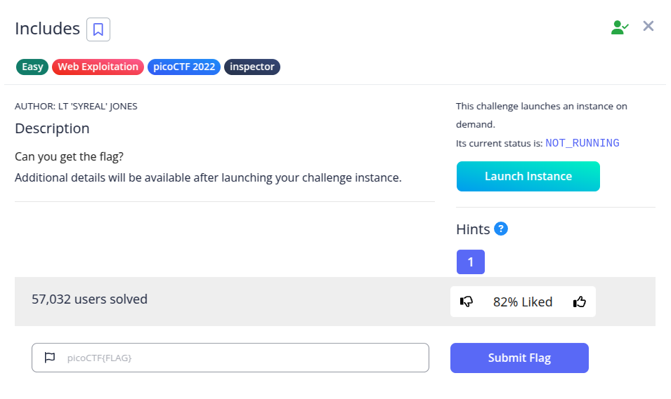
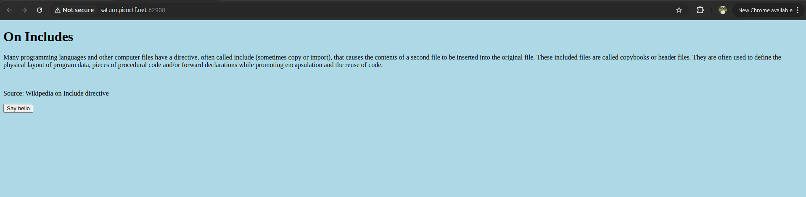
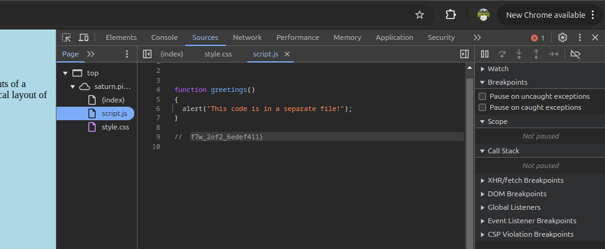
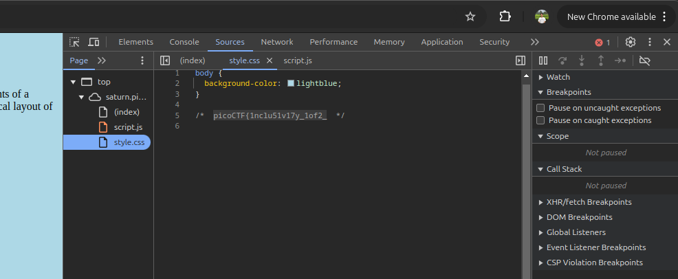

Hint
- Is there more code than what the inspector initially shows?

Pada soal diberikan sebuah web berikut.

Langkah pertama saya buka source code nya, saya menemukan potongan flag di file script.js

Potongan lainnya ada di file style.css

**Flag : picoCTF{1nclu51v17y_1of2_f7w_2of2_6edef411}**