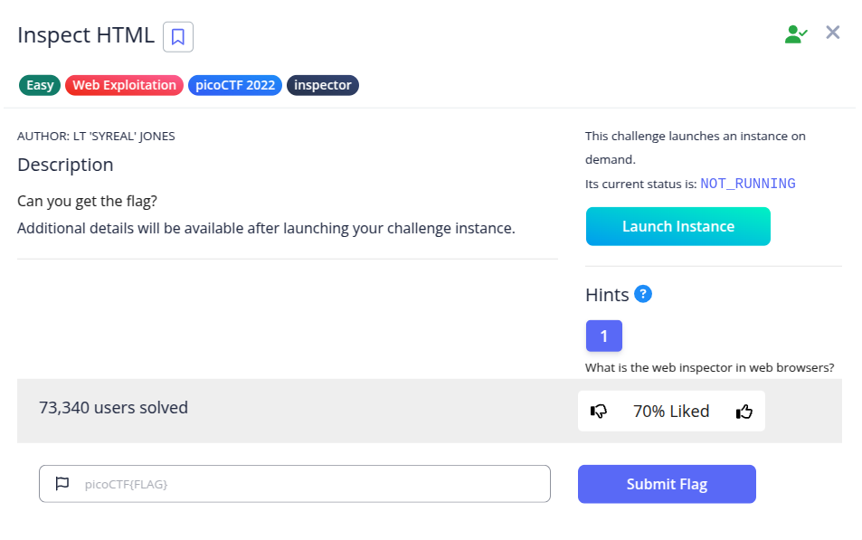
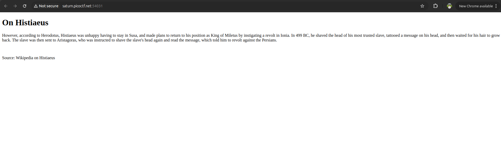
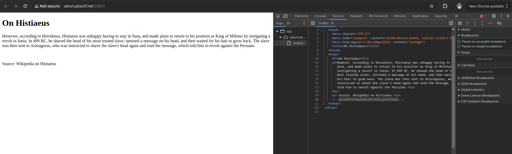

Pada challenge ini, kita diberikan sebuah halaman web statis sederhana.



Sesuai judul challenge (*Inspect HTML*) dan petunjuknya (*"What is the web inspector in web browsers?"*), kita dapat memanfaatkan fitur *Inspect Element* atau *View Page Source* (`Ctrl + U` atau `F12`) pada browser untuk memeriksa struktur HTML halaman.

Saat memeriksa dokumen HTML melalui **Developer Tools → Sources**:



Ditemukan sebuah komentar HTML (`<!-- ... -->`) pada baris ke-20 yang memuat flag:

```html
<!--picoCTF{1n5p3t0r_0f_h7ml_8113f7e2}-->
```

**Flag:** `picoCTF{1n5p3t0r_0f_h7ml_8113f7e2}`
