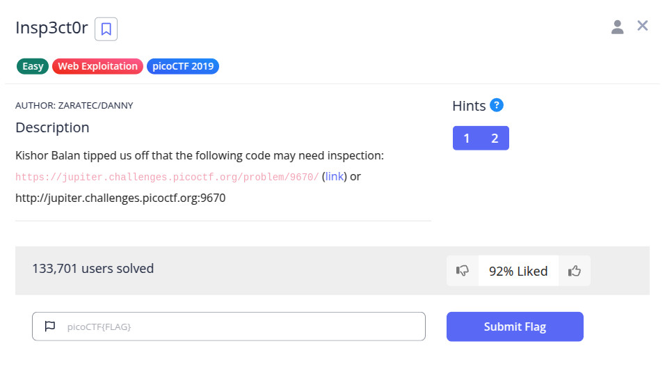
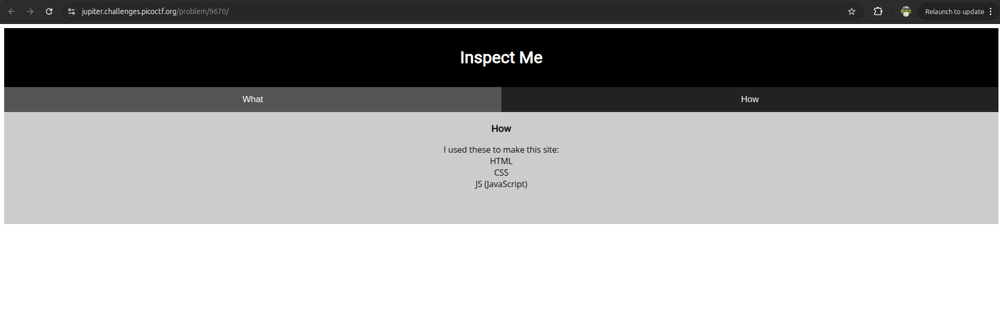
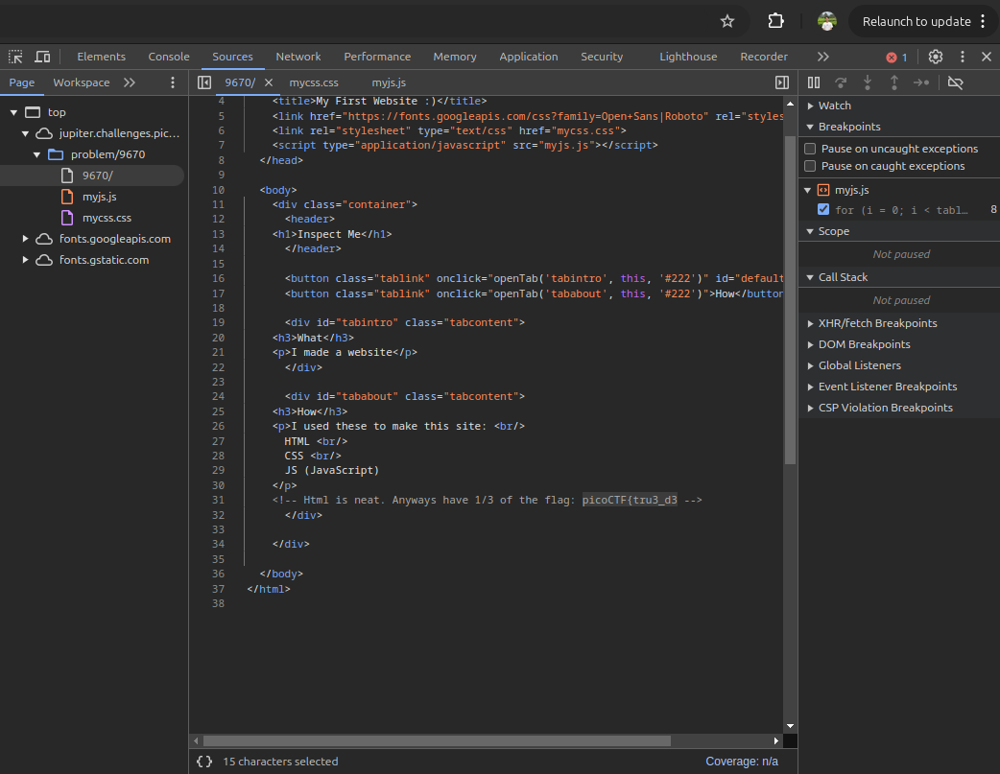

Hint :
- How do you inspect web code on a browser?
- There's 3 parts

Pada soal diberikan sebuah web berikut.

Berdasarkan hint yang diberikan, saya menduga bahwa flag berada di dalam source code website. Setelah melakukan inspect, saya menemukan flag yang terpisah menjadi 3 bagian pada halaman 9670/, myjs.js, mycss.css

**Flag : picoCTF{tru3_d3t3ct1ve_0r_ju5t_lucky?2e7b23e3}**