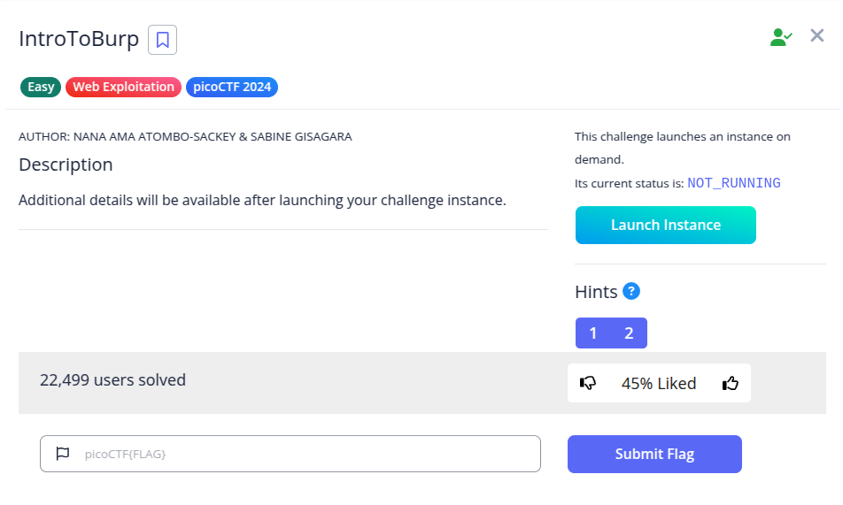
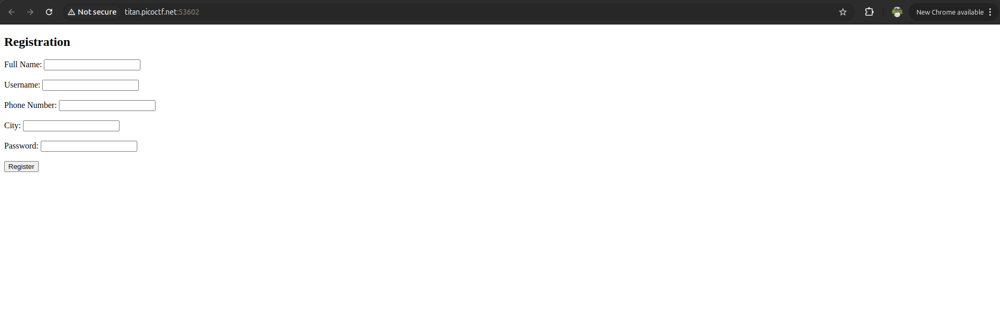
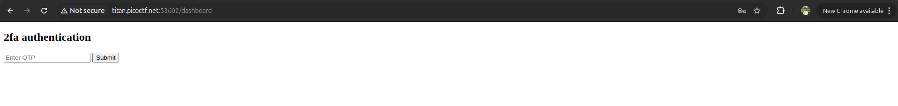
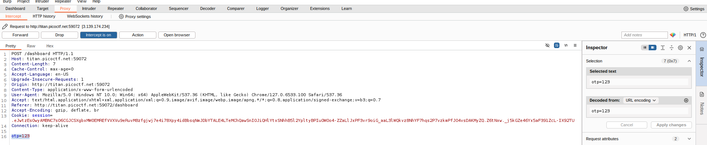
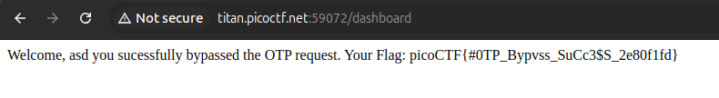

Pada challenge ini, kita diberikan sebuah aplikasi web yang memiliki form registrasi pengguna.

Setelah mengisi form registrasi sembarang, kita diarahkan ke tahap verifikasi dua langkah (*2fa authentication*) yang meminta kode OTP:

Jika kita menginputkan nilai OTP sembarang, server akan menolak dengan error *Invalid OTP*. Namun, hint soal memberikan petunjuk menarik: *"Try mangling the request, maybe their server-side code doesn't handle malformed requests very well"*.

Hal ini mengindikasikan adanya kelemahan logika di sisi server (kerentanan **Parameter Tampering**). Server kemungkinan hanya memvalidasi OTP jika parameter `otp` ditemukan pada request. Jika parameter tersebut dihilangkan sama sekali, pengecekan dapat terlewati (*bypassed*).

Langkah eksploitasi menggunakan **Burp Suite**:
1. Aktifkan **Proxy → Intercept is on** di Burp Suite.
2. Masukkan sembarang nilai OTP pada web lalu klik **Submit**.
3. Tangkap request `POST /dashboard` pada Burp Suite.
4. Hapus parameter `otp=...` pada bagian request body hingga kosong:

5. Teruskan request dengan menekan tombol **Forward**.

Server tidak memvalidasi OTP karena parameternya tidak ada, sehingga autentikasi berhasil dilewati dan halaman menampilkan flag:

**Flag:** `picoCTF{#0TP_Bypvss_SuCc3$S_2e80f1fd}`