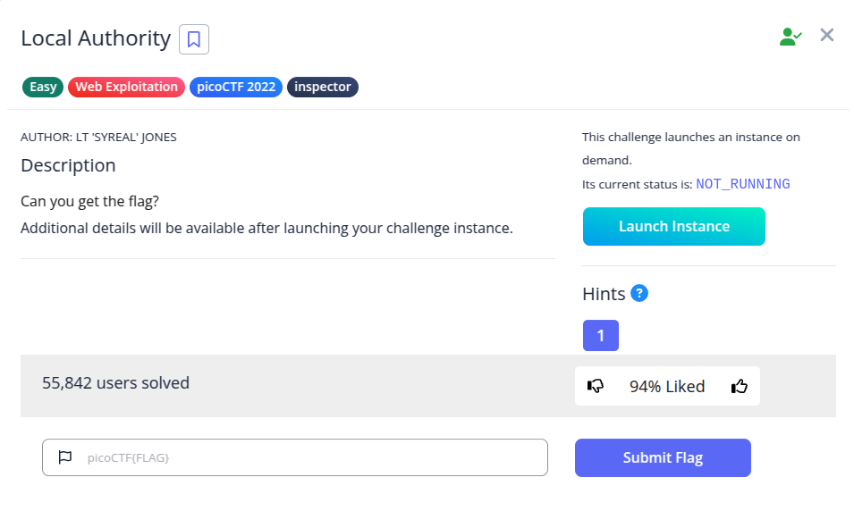
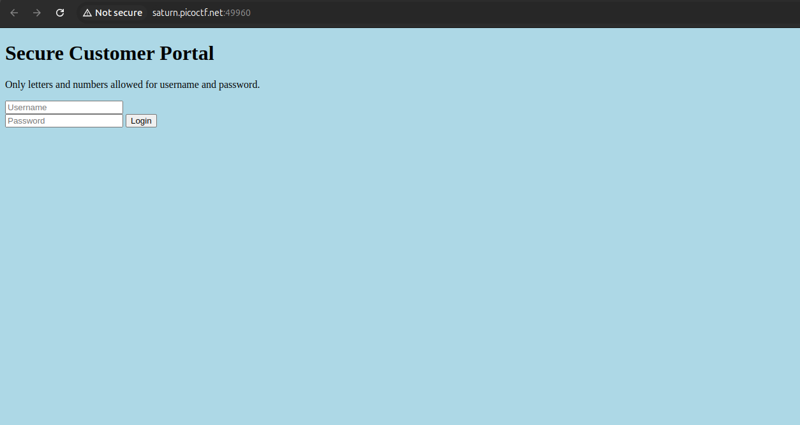
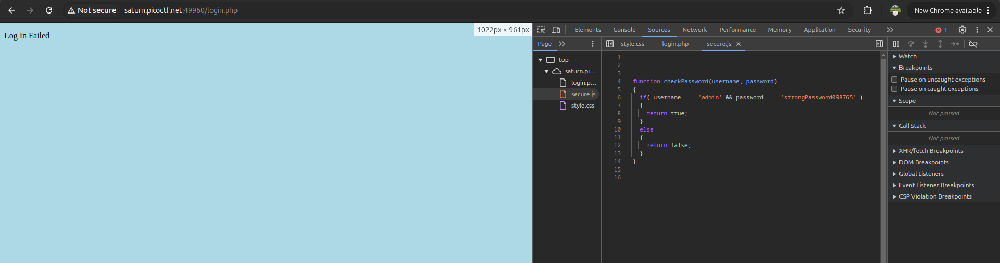
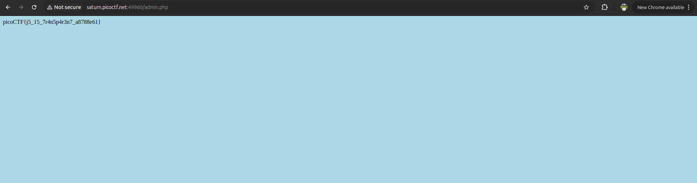

Pada challenge ini, diberikan sebuah portal login pelanggan (*"Secure Customer Portal"*).



Sesuai judul challenge (*Local Authority*), proses verifikasi login ditangani secara lokal di sisi *client* (browser).

Ketika kita mencoba login dengan sembarang input, halaman dialihkan ke `login.php` dengan pesan *Log In Failed*. Namun, saat memeriksa berkas yang dimuat melalui **Developer Tools → Sources**, terdapat file JavaScript eksternal bernama `secure.js`:



Di dalam `secure.js`, fungsi validasi `checkPassword()` menyimpan kredensial login secara langsung (*hardcoded*):

```javascript
function checkPassword(username, password) {
  if (username === 'admin' && password === 'strongPassword098765') {
    return true;
  } else {
    return false;
  }
}
```

Dengan memasukkan kredensial tersebut pada form login:
- **Username:** `admin`
- **Password:** `strongPassword098765`

Kita berhasil masuk dan diarahkan ke endpoint `admin.php` yang memuat flag:



**Flag:** `picoCTF{j5_15_7r4n5p4r3n7_a8788e61}`