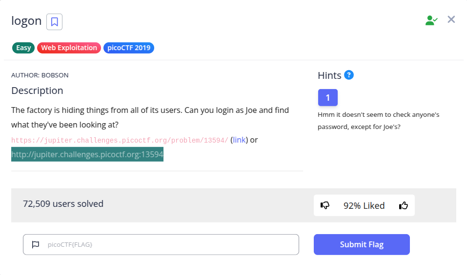
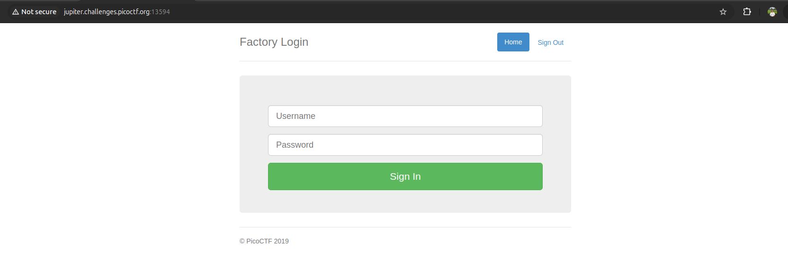
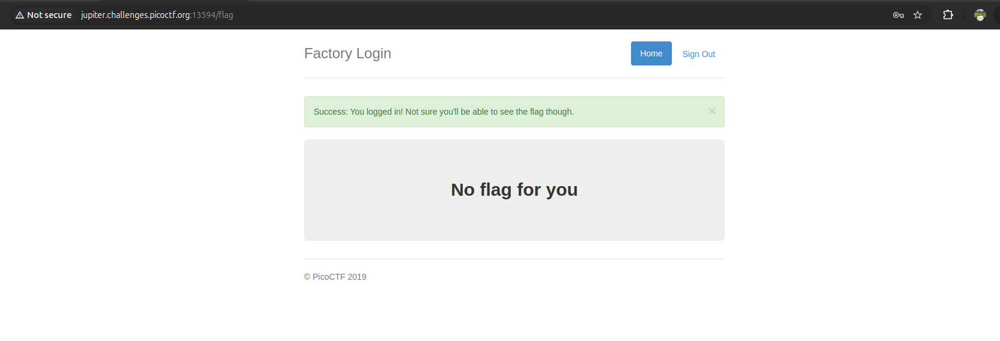
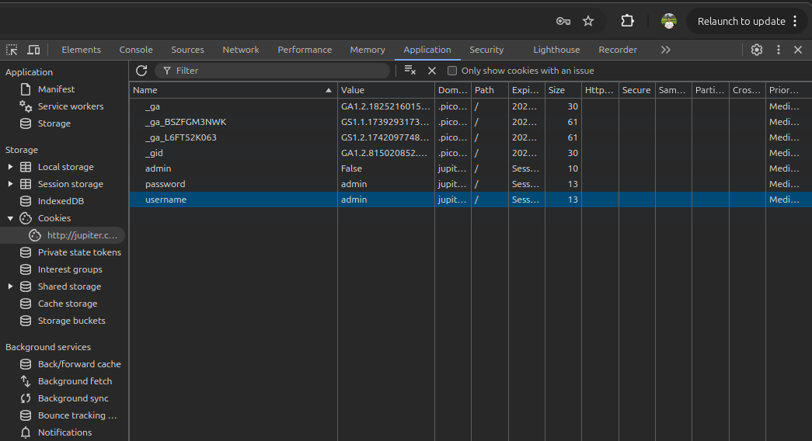
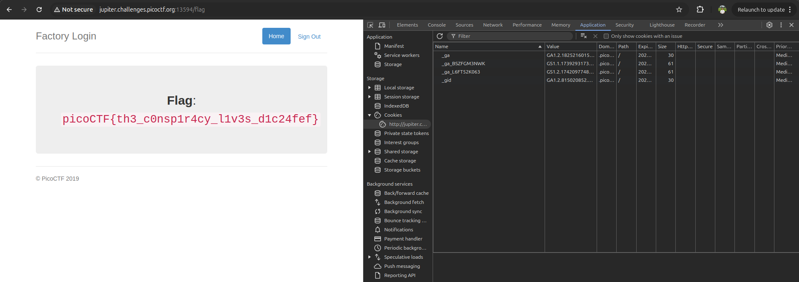

Pada challenge ini, diberikan sebuah aplikasi web (*"Factory Login"*) dengan form login sederhana.

Sesuai petunjuk pada hint (*"Hmm it doesn't seem to check anyone's password, except for Joe's?"*), sistem tidak memvalidasi password secara ketat untuk pengguna umum.

Ketika kita mencoba login menggunakan kredensial sembarang (misalnya username `admin` dan password `admin`), kita berhasil masuk ke endpoint `/flag`, namun sistem menampilkan pesan: *"No flag for you"*.

Hal ini mengindikasikan bahwa hak akses untuk melihat flag ditentukan oleh parameter sesi atau cookie di sisi *client*. Saat memeriksa tab **Developer Tools → Application → Cookies**, ditemukan cookie bernama `admin` bernilai `False`:

Karena server mempercayai nilai cookie secara mentah tanpa adanya verifikasi integritas/enkripsi, kita dapat memanipulasi nilainya langsung:
1. Ubah nilai cookie `admin` dari `False` menjadi `True`.
2. Muat ulang (*refresh*) halaman `/flag`.

Halaman berhasil menampilkan flag:

**Flag:** `picoCTF{th3_c0nsp1r4cy_l1v3s_d1c24fef}`