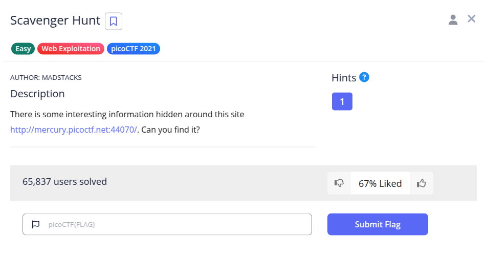
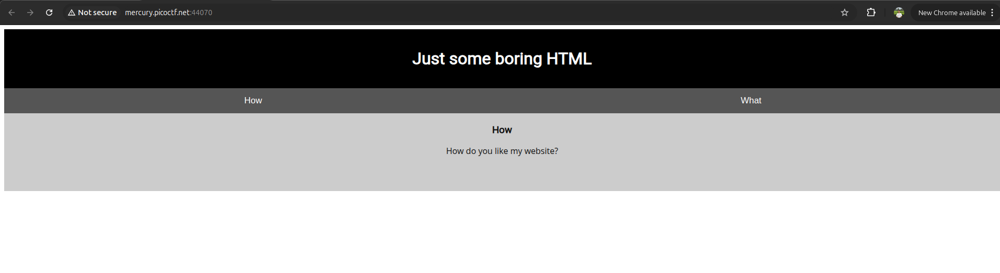
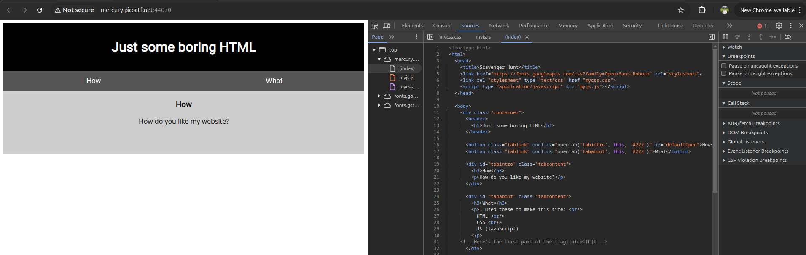
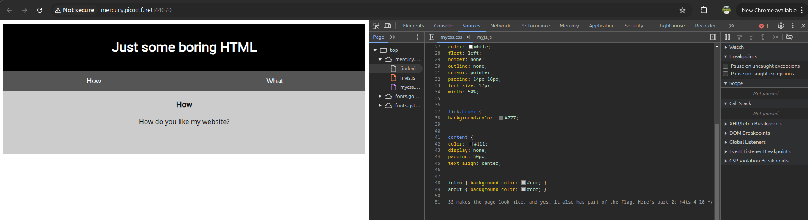
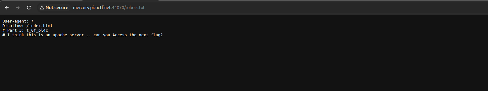
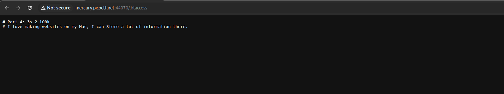
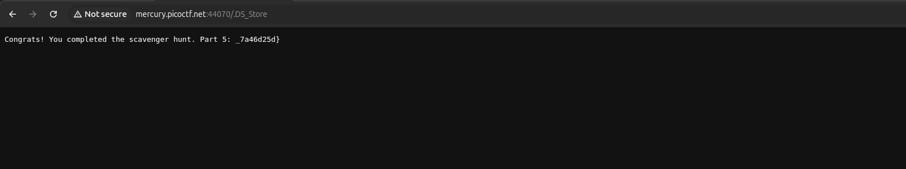

Diberikan sebuah situs web sederhana dengan instruksi untuk menemukan potongan flag yang tersebar di beberapa file web tanpa melakukan *brute force*.



Flag dipecah menjadi 5 bagian yang tersembunyi di dalam komentar kode sumber serta file konfigurasi web standar. Setiap bagian memberikan petunjuk untuk menemukan file berikutnya:

#### 1. Part 1 - HTML Source (`index.html`)
Membuka Developer Tools (tab **Sources** atau **Elements**) pada halaman utama `index.html`. Pada komentar HTML ditemukan potongan pertama:
```html
<!-- Here's the first part of the flag: picoCTF{t -->
```

- **Part 1:** `picoCTF{t`

#### 2. Part 2 - Stylesheet (`mycss.css`)
Memeriksa file CSS yang dihubungkan pada halaman web (`mycss.css`). Di bagian paling bawah file terdapat komentar berisi potongan kedua:
```css
/* CSS makes the page look nice, and yes, it also has part of the flag. Here's part 2: h4ts_4_l0 */
```

- **Part 2:** `h4ts_4_l0`

#### 3. Part 3 - JavaScript Hint & `robots.txt`
Memeriksa file JavaScript `myjs.js` yang menyertakan petunjuk:
> *"How can I keep Google from indexing my website?"*

File standar yang digunakan untuk mengontrol pengindeksan web crawler/mesin pencari adalah `robots.txt`. Mengakses URL `/robots.txt` menampilkan potongan ketiga beserta petunjuk berikutnya:
```text
User-agent: *
Disallow: /index.html
# Part 3: t_0f_pl4c
# I think this is an apache server... can you Access the next flag?
```

- **Part 3:** `t_0f_pl4c`

#### 4. Part 4 - Apache Configuration (`.htaccess`)
Petunjuk *"I think this is an apache server... can you Access the next flag?"* dengan penekanan kata **Access** merujuk pada file konfigurasi direktori web server Apache, yaitu `.htaccess`.

Mengakses URL `/.htaccess` menampilkan:
```text
# Part 4: 3s_2_lO0k
# I love making websites on my Mac, I can Store a lot of information there.
```

- **Part 4:** `3s_2_lO0k`

#### 5. Part 5 - macOS Metadata (`.DS_Store`)
Petunjuk *"I love making websites on my Mac, I can Store a lot of information there."* dengan penekanan kata **Store** merujuk pada file metadata folder bawaan macOS, yaitu `.DS_Store`.

Mengakses URL `/.DS_Store` menampilkan potongan terakhir flag:
```text
Congrats! You completed the scavenger hunt. Part 5: _7a46d25d}
```

- **Part 5:** `_7a46d25d}`

---

### Penggabungan Flag
Menggabungkan kelima potongan dari Part 1 hingga Part 5:
- Part 1: `picoCTF{t`
- Part 2: `h4ts_4_l0`
- Part 3: `t_0f_pl4c`
- Part 4: `3s_2_lO0k`
- Part 5: `_7a46d25d}`

**Flag:** `picoCTF{th4ts_4_l0t_0f_pl4c3s_2_lO0k_7a46d25d}`