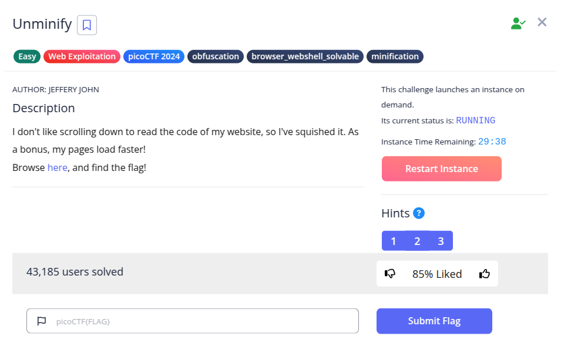
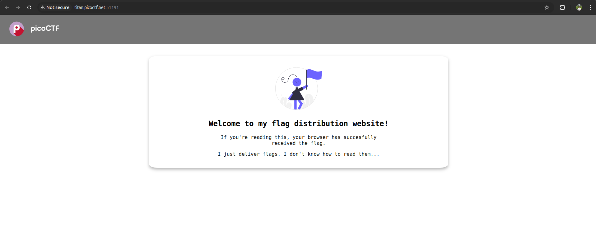
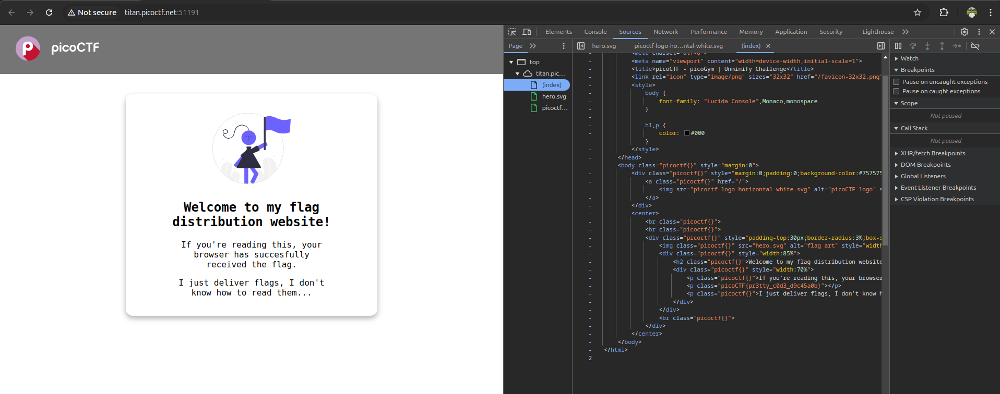

Hint :
- Try CTRL+U / ⌘+U in your browser to view the page source. You can also add 'view-source:' before the URL, or try curl <URL> in your shell.
- Minification reduces the size of code, but does not change its functionality.
- What tools do developers use when working on a website? Many text editors and browsers include formatting.

Pada soal diberikan sebuah web berikut.

Pertama saya cek source code halaman tersebut. Saya langsung mendapatkan flagnya.

**Flag: picoCTF{pr3tty_c0d3_d9c45a0b}**