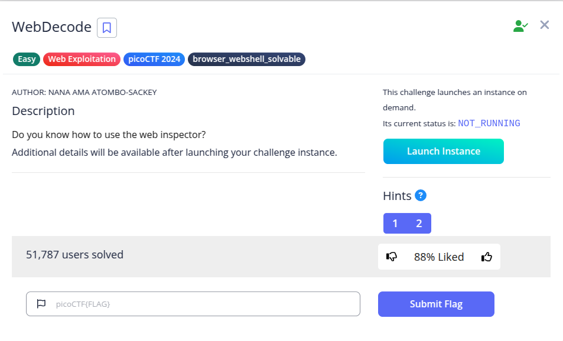
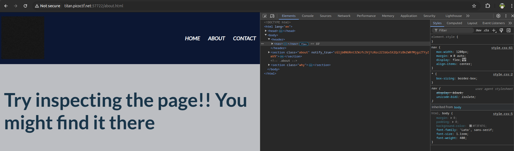
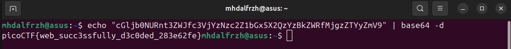

Hint
- Use the web inspector on other files included by the web page.
- The flag may or may not be encoded

Pada soal diberikan sebuah web berikut.

Pada source code halaman about, saya menemukan string unik yang sepertinya itu adalah hasil encode base64.

Langsung saja saya decode kembali dengan base64.

**Flag :  picoCTF{web_succ3ssfully_d3c0ded_283e62fe}**